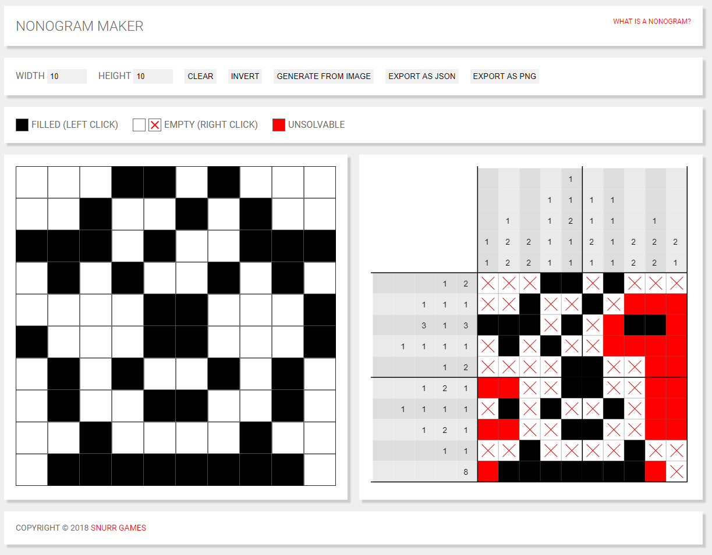

# Nonogram-Maker
A solvable [Nonogram](https://en.wikipedia.org/wiki/Nonogram) puzzle generator
 
Based on the Python [Nonogram Solver]https://github.com/Snurr-Games/Nonogram-Maker) by [@Kniffen](https://github.com/Snurr-Games/Nonogram-Maker/commits?author=kniffen)

Try it at <>

